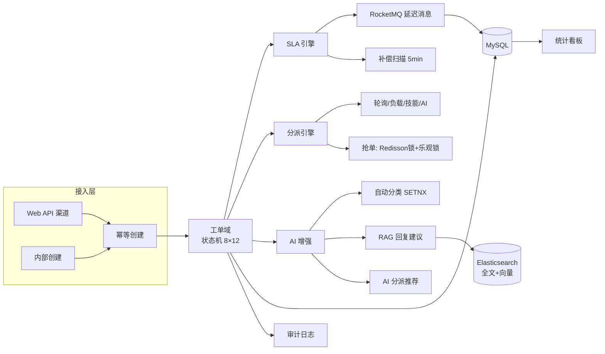

# TicketAI 企业智能客服工单系统

AI 增强的企业级客服工单系统：多渠道接入客户请求，工单全生命周期管理，SLA 超时自动升级，LLM 自动分类与 RAG 回复建议。

## 功能特性

- **工单全生命周期**：创建 → 自动分派 → 抢单 → 处理 → 解决 → 关闭，状态机驱动（8 状态 × 12 事件，23 条合法转移，非法流转全量拒绝）
- **SLA 引擎**：RocketMQ 延迟消息精确到点结算 + 每 5 分钟补偿扫描双保险，超时自动升级并落审计
- **分派策略**：轮询 / 负载最低 / 技能匹配 / AI 推荐四种策略，按权重降序自动尝试，抢单采用 Redisson 锁 + 乐观锁双保险
- **AI 增强**（可降级）：工单自动分类（SETNX 防重）、RAG 回复建议（ES 向量检索相似工单 + 知识库）、AI 分派推荐；LLM 不可用系统全流程照常
- **检索**：Elasticsearch 全文 + dense_vector 语义双路检索，双写一致性（MQ 重试 + 补偿对账）
- **管理后台**：坐席 / 技能组 / SLA 策略 / 知识库 / 统计看板（SLA 按时率、平均响应时长等）

## 技术栈

| 层 | 技术 |
|---|---|
| 后端 | Spring Boot 3.5 · JDK 23（编译目标 21）· MyBatis-Plus 3.5 |
| 中间件 | MySQL 8.0 · Redis · RocketMQ 5.3（延迟消息）· Elasticsearch 8.14（全文 + 向量） |
| 安全 | JWT 双 token（Lua 原子刷新旋转）+ RBAC 权限码 |
| 前端 | Vue 3 · Vite 5 · Element Plus · Pinia · ECharts |
| AI | OpenAI 兼容协议自研客户端（chat / embeddings），每次调用记录 token 用量 |

## 系统架构



## 快速开始

### 环境要求

MySQL 8.0（服务运行）、Redis（6379）、RocketMQ（9876/10911）、Elasticsearch（9200）。中间件容器编排见 `infra/docker-compose.yml`（`docker compose up -d`）。

### 后端

```bash
cd ticket-server
# 初始化数据库（建库建表 + 初始数据）
mysql -uroot -p < ../sql/schema.sql
# 可选：演示数据（100 张工单 + 20 篇文章）
mysql -uroot -p ticket_ai < ../sql/demo_data.sql
mvn spring-boot:run   # 端口 8090
```

### 前端

```bash
cd frontend
npm install --registry=https://registry.npmmirror.com
npm run dev           # http://localhost:5173
```

### 演示账号

| 账号 | 密码 | 角色 |
|---|---|---|
| admin | Admin@12345 | 管理员（全部权限） |
| agent01 | Admin@12345 | 坐席（领取/回复/解决等） |

### LLM 配置（可选，不配则 AI 功能自动降级）

```bash
export LLM_API_KEY=sk-xxx            # OpenAI 兼容
export LLM_BASE_URL=http://127.0.0.1:8000/v1
```

## 测试

```bash
cd ticket-server && mvn test   # 39 个用例：状态机 23 条转移全量断言、10 线程并发抢单、SLA 结算、幂等、AI 降级
```

## 文档

完整开发文档（环境基线、状态机矩阵、API 契约、里程碑验收标准）见 [docs/DEV_DOC.md](docs/DEV_DOC.md)。
